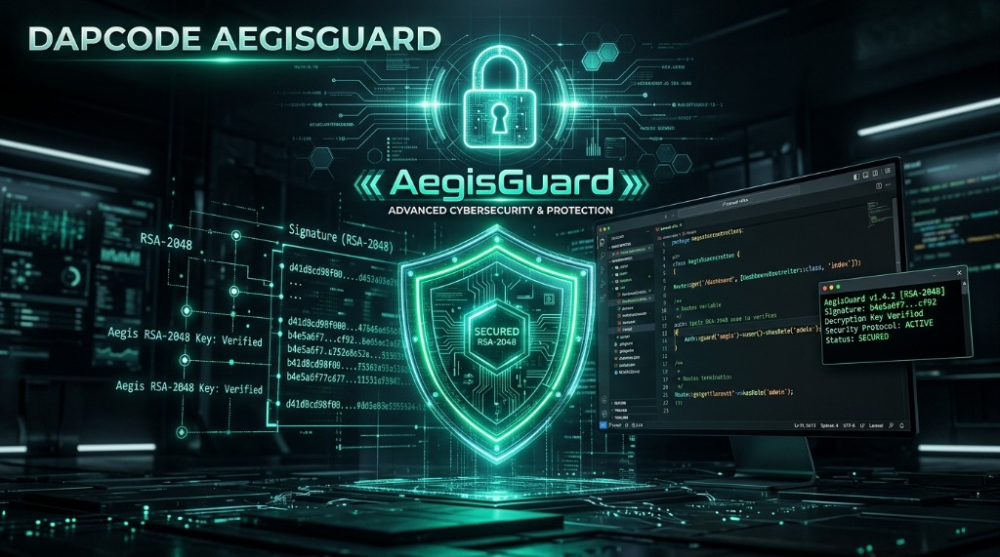

# 🚀 DapCode App — Modular HMVC Portfolio & Developer Ecosystem

<p align="center">
  
  
  
  
  
  
  
  
  
</p>

<p align="center">
  
</p>

**DapCode App** adalah platform portofolio digital dan ekosistem pengembang modern yang dibangun di atas framework **Laravel** dengan arsitektur modular **HMVC (Hierarchical Model-View-Controller)**, frontend asset pipeline modern bertenaga **Laravel Vite**, serta sistem proteksi multi-lapis terenkripsi **DapCode AegisGuard™** (*6-Layer Defense-in-Depth, Asymmetric RSA-2048 Digital Licensing, and AES-256-GCM Envelope Encryption*).

---

## 🌟 Fitur Utama (Key Features)

### 1. 🏛️ Arsitektur Modular HMVC & Dynamic Dispatcher
Seluruh fitur dikelompokkan dalam modul independen di dalam direktori `app/Modules/`:
- **Model, View, Controller, dan Route** terisolasi rapi untuk setiap modul.
- *Dynamic Auto-Dispatcher* (`HMVC.php` & `HMVCServiceProvider.php`) yang meresolusi modul, sub-controller, action, dan parameter URL secara otomatis.
- *Hierarchical Sub-Requests* via helper `hmvc('ModuleName@action', $params)` untuk merender komponen antar-modul secara aman.
- *Module Scoped Rendering* via `$this->moduleRender('viewName', $data)` di Base Controller.

### 2. 🛡️ DapCode AegisGuard™ (6-Layer Defense-in-Depth Security)
Sistem keamanan enterprise yang menggabungkan kriptografi kunci asimetris (**RSA-2048 + SHA-256**) dan enkripsi amplop (**AES-256-GCM**) dengan arsitektur pertahanan berlapis:
- **Layer 1 (HTTP Middleware & Dynamic Route Guard):** Mencegat seluruh request HTTP menuju modul sebelum mencapai controller.
- **Layer 2 (HMVC Engine & Cross-Module Isolation):** Memblokir eksekusi controller langsung atau bypass via HMVC jika modul belum diotorisasi.
- **Layer 3 (Core BaseController Guard):** Pengecekan lisensi pada inisialisasi constructor controller (`App\Http\Controllers\Core`).
- **Layer 4 (RSA-2048 Digital Licensing & Authority Passcode):** Tanda tangan digital asimetris dengan verifikasi hash satu arah (SHA-256 constant-time). Repositori klien **bebas dari hardcoded plaintext passcodes & private keys**.
- **Layer 5 (Integrity Verification & Anti-Tampering Engine):** Memeriksa integritas SHA-256 seluruh file core security. Modifikasi file ilegal langsung memicu *fail-closed*.
- **Layer 6 (AES-256-GCM Envelope Encryption & Fail-Closed Lock):**
  - **Fresh Clone State:** Source code controller & model tersimpan dalam format terenkripsi **`.php.enc`** di `app/Modules/{Module}/Encrypted/`.
  - **Auto-Unlock:** Saat diaktivasi dengan lisensi resmi, file didekripsi menjadi `.php` di disk lokal.
  - **Auto-Lock:** Saat lisensi dicabut (*Revoke*), file `.php` dihapus dari disk sehingga kembali ke status terenkripsi dan fail-closed.
  - **Git Leak-Proof:** File `.php` plaintext diabaikan oleh `.gitignore` sehingga **hanya file `.php.enc` yang di-push ke GitHub**.

### 3. 🖥️ Developer Web Terminal & Authority Signer (`/dapcode/terminal`)
- **Interactive Artisan Console:** Menjalankan perintah Laravel Artisan secara visual dengan riwayat perintah (*keyboard history*), auto-scroll, dan output berwarna.
- **Dedicated Make Module Modal:** Tombol **`+ Make Module`** untuk membuat modul baru lengkap (Controller, Model, View, Core Base Controller, dan auto-enkripsi Layer 6).
- **RSA-2048 License Signer:** Menghasilkan signed activation payload dan signed revocation token secara instan dengan proteksi passcode Authority.
- **Custom Floating Toast Notifications:** Seluruh notifikasi menggunakan komponen UI modern (*no native browser alerts*).

### 4. ⚡ Modern Frontend Asset Pipeline (Laravel Vite)
- Ditenagai **Vite** & **laravel-vite-plugin** dengan kompilasi super cepat dan *Hot Module Replacement* (HMR).
- Integrasi Blade native melalui directive `@vite(['resources/css/app.css', 'resources/js/app.js'])`.
- Modul JavaScript modern berbasis standard ES Modules (ESM).

### 5. 🇮🇩 Indonesian Holiday & Celebration Theme Engine
Sistem tema dinamis yang otomatis mendeteksi kalender hari besar nasional Indonesia:
- **HUT Kemerdekaan RI (17 Agustus):** Merah Putih, font *Cinzel*, glow kemerdekaan.
- **Hari Raya Idul Fitri & Ramadhan:** Emerald & Gold, font *Amiri*, ornamen islami.
- **Tahun Baru Imlek:** Imperial Crimson & Gold, font *Playfair Display*.
- **Hari Raya Natal & Tahun Baru:** Pine Green & Crimson Snow.
- **Hari Lahir Pancasila, Sumpah Pemuda, Hari Pahlawan, Hari Kartini, Waisak, & Tahun Baru Masehi.**
- **Manual Selector:** Pengguna dapat mengganti tema secara bebas melalui ikon palet di header (`/theme/{key}`).

### 6. 🌐 Dual-Language Localization (ID / EN)
- Dukungan penuh multi-bahasa untuk seluruh modul dan antarmuka sistem (`/lang/id` & `/lang/en`).

---

## 📂 13 Modul HMVC Terproteksi

| # | Modul | Kategori | Status Fresh Clone | Rute Utama |
|---|---|---|---|---|
| 1 | **Dashboard** | Core Analytics | 🔒 **LOCKED (Encrypted)** | `/dashboard` |
| 2 | **Profile** | Bio & Identitas | 🔒 **LOCKED (Encrypted)** | `/profile` |
| 3 | **Education** | Riwayat Akademik | 🔒 **LOCKED (Encrypted)** | `/education` |
| 4 | **Commerce** | Katalog Produk & Layanan | 🔒 **LOCKED (Encrypted)** | `/commerce` |
| 5 | **Research** | Riset & Publikasi Ilmiah | 🔒 **LOCKED (Encrypted)** | `/research` |
| 6 | **Career** | Rekam Jejak Karir | 🔒 **LOCKED (Encrypted)** | `/career` |
| 7 | **Activity** | Komunitas & Organisasi | 🔒 **LOCKED (Encrypted)** | `/activity` |
| 8 | **Media** | Galeri Multimedia | 🔒 **LOCKED (Encrypted)** | `/media` |
| 9 | **Achievement** | Prestasi & Penghargaan | 🔒 **LOCKED (Encrypted)** | `/achievement` |
| 10 | **Certification** | Sertifikasi & Lisensi Profesi | 🔒 **LOCKED (Encrypted)** | `/certification` |
| 11 | **Interest** | Bidang Minat & Keahlian | 🔒 **LOCKED (Encrypted)** | `/interest` |
| 12 | **Project** | Portofolio Proyek | 🔒 **LOCKED (Encrypted)** | `/project` |
| 13 | **Setting** | Konfigurasi Sistem | 🔒 **LOCKED (Encrypted)** | `/setting` |

---

## 🛠️ Struktur Direktori Proyek

```text
dapcode-app/
├── app/
│   ├── Console/Commands/
│   │   ├── DapcodeModuleCommand.php   # Status modul: php artisan dapcode:module
│   │   ├── DapcodePackCommand.php     # Re-encrypt kode develop: php artisan dapcode:pack
│   │   ├── MakeHMVCModule.php         # Generator modul baru: php artisan make:module
│   │   └── SignDapcodeLicense.php     # Authority CLI Signer (RSA-2048 Private Key)
│   ├── Http/
│   │   ├── Controllers/
│   │   │   ├── Controller.php         # Base Controller (Layer 3 Guard)
│   │   │   ├── PortfolioController.php # Landing Page Portofolio (/)
│   │   │   ├── Dapcode/
│   │   │   │   └── LicenseController.php # Activation, Terminal & Signer Handlers
│   │   │   └── Core/                  # Base Controllers per Modul
│   │   └── Middleware/
│   │       └── DapcodeLicenseMiddleware.php # Layer 1 Dynamic Route Interceptor
│   ├── Modules/                       # 13 Modul HMVC Terenkripsi
│   │   ├── Dashboard/
│   │   │   ├── Encrypted/             # File .php.enc & manifest.json (Naik ke Git)
│   │   │   ├── Controllers/           # Plaintext .php (Lokal saat aktif, di-.gitignore)
│   │   │   ├── Models/                # Plaintext .php (Lokal saat aktif, di-.gitignore)
│   │   │   └── Views/                 # Blade View Templates (Naik ke Git)
│   │   └── ... (13 Modules)
│   ├── Providers/
│   │   ├── AppServiceProvider.php
│   │   └── HMVCServiceProvider.php    # Dynamic HMVC Route & View Namespace Loader
│   └── Services/
│       ├── Dapcode/                   # DapCode AegisGuard™ Core Engine
│       │   ├── InstallationService.php # ID Instalasi Unik Persisten (DAP-XXXXXX-...)
│       │   ├── LicenseVerifier.php    # Verifikasi Kriptografi RSA-2048 & Hash Passcode
│       │   ├── ActivationService.php  # Handler Aktivasi & Pencabutan Lisensi
│       │   ├── ModuleEncryptionService.php # AES-256-GCM Envelope Encryption Engine
│       │   ├── LicenseGuard.php       # Sentral Pengecekan Izin Akses Modul
│       │   └── IntegrityService.php   # Layer 5 SHA-256 Anti-Tampering Engine
│       └── HMVC/
│           └── HMVC.php               # Core Dispatcher & Hierarchical Request Engine
├── config/
│   └── dapcode.php                    # Konfigurasi Modul & Kriptografi
├── docs/
│   └── security/
│       ├── dapcode-threat-model.md    # Threat Model & Trust Boundaries
│       └── dapcode-license-architecture.md # Architecture & Hardening Guide
├── resources/
│   └── views/
│       ├── dapcode/
│       │   ├── activate.blade.php     # Form Aktivasi & Deaktivasi Lisensi
│       │   ├── authority-terminal.blade.php # Developer Web Terminal & RSA-2048 Signer
│       │   └── license-required.blade.php # Tampilan Error Saat Modul Terkunci (403)
│       └── portfolio.blade.php        # Landing Page Portofolio
├── tests/
│   └── Feature/
│       ├── DapcodeEncryptedModuleSecurityTest.php # 25 Tests Enkripsi AES-256-GCM
│       ├── DapcodeLayeredGuardSecurityTest.php    # 12 Tests Multi-Layer Protection
│       └── DapcodeLicenseSecurityTest.php         # 22 Tests Verifikasi Lisensi RSA
└── routes/
    └── web.php                        # Routing Web & DapCode Endpoints
```

---

## 🚀 Panduan Instalasi & Menjalankan Aplikasi

### 1. Kloning Repositori
```bash
git clone https://github.com/codedaffa/dapcode-app.git
cd dapcode-app
```

### 2. Instal Dependensi Composer & NPM
```bash
composer install
npm install
```

### 3. Konfigurasi Lingkungan (.env)
```bash
cp .env.example .env
php artisan key:generate
```

### 4. Build Frontend Asset (Vite)
```bash
# Mode Development (Live Hot-Reload):
npm run dev

# Atau Mode Production (Build & Minify):
npm run build
```

### 5. Menjalankan Server Laravel
```bash
php artisan serve
```
Buka browser pada: **`http://127.0.0.1:8000`**

---

## 💻 Panduan Pengembangan Modul Baru (*Developer Workflow*)

### A. Membuat Modul Baru:
Gunakan Web Terminal di `http://127.0.0.1:8000/dapcode/terminal` lalu klik tombol **`+ Make Module`**, atau via CLI:
```bash
php artisan make:module Blog
```
*Perintah ini otomatis membuat struktur Controller, Model, View, Core Base Controller, mengemas enkripsi `.php.enc`, dan mengunci modul dalam status fresh clone.*

### B. Mengembangkan & Mengemas Kode Terbaru (*Pack*):
Setelah Anda mengedit kode `.php` modul lokal dan ingin merilisnya ke Git/GitHub:
```bash
# Mengemas 1 modul spesifik:
php artisan dapcode:pack Blog

# Atau mengemas seluruh modul sekaligus:
php artisan dapcode:pack all
```
*Perintah ini mengambil kode terbaru, mengenkripsinya ke `.php.enc`, memperbarui manifest integritas, dan mengunci file plaintext agar aman saat di-commit ke Git.*

---

## 🔑 Panduan Otorisasi Lisensi (Authority Signer)

Sebagai pemilik (*Owner / Authority*), Anda dapat men-generate payload lisensi bertanda tangan digital (**RSA-2048**) melalui:

### 1. 🖥️ Menggunakan Authority Web Terminal
Buka URL: **`http://127.0.0.1:8000/dapcode/terminal`**
1. Pilih Tab: **RSA-2048 License Signer**.
2. Pilih Aksi: **Otorisasi Lisensi (ACTIVATE)** atau **Pencabutan Lisensi (REVOKE)**.
3. Masukkan **Authority Passcode**.
4. Masukkan **Installation ID** klien (tersedia tombol *"Gunakan ID Instalasi Ini"*).
5. Pilih durasi dan modul yang diizinkan (atau *Full Wildcard `*`*).
6. Klik **"Tanda Tangani Digital"** &rarr; Salin payload JSON atau klik **"Terapkan ke Form Aktivasi Sistem"** untuk aktivasi instan 1-klik!

### 2. ⚡ Menggunakan Artisan CLI
```bash
# Generate Lisensi Penuh (Semua Modul *, Berlaku 2 Tahun):
php artisan dapcode:sign-license <INSTALLATION_ID> --passcode="<AUTHORITY_PASSCODE>"

# Generate Lisensi Parsial (Hanya Modul Tertentu):
php artisan dapcode:sign-license <INSTALLATION_ID> --modules=commerce --modules=project --passcode="<AUTHORITY_PASSCODE>"

# Generate Signed Revocation Token (Pencabutan Lisensi):
php artisan dapcode:sign-license --revoke --license_id=<LICENSE_ID> --passcode="<AUTHORITY_PASSCODE>"
```

---

## 🧪 Menjalankan Automated Security Tests (100% Pass)

Aplikasi dilengkapi **61 Automated Feature & Security Tests** untuk menguji seluruh lapisan pertahanan:

```bash
php artisan test
```

### Rincian Cakupan Test Suite:
* ✅ **`DapcodeEncryptedModuleSecurityTest` (25 Tests):** Menguji status fresh clone locked, dekripsi saat aktivasi, pembersihan plaintext saat revocation, cipher tampering, tag verification, path traversal, dan manipulasi manifest.
* ✅ **`DapcodeLayeredGuardSecurityTest` (12 Tests):** Menguji ketahanan Layer 1–6 terhadap middleware bypass, controller direct invocation, HMVC sub-request injection, tampered core files, dan canonical path obfuscation.
* ✅ **`DapcodeLicenseSecurityTest` (22 Tests):** Menguji validasi tanda tangan RSA-2048, verifikasi expired date, granular module licensing, anti-forgery request headers/cookies, dan hash passcode validation.
* ✅ **`ExampleTest` (2 Tests):** Unit & basic application assertions.

---

## 🎨 Penyesuaian Tema Hari Raya (Theme Switcher)

Anda dapat menguji tema perayaan secara langsung melalui URL:
* **Otomatis (Berdasarkan Kalender):** `http://127.0.0.1:8000/theme/auto`
* **HUT Kemerdekaan RI:** `http://127.0.0.1:8000/theme/kemerdekaan`
* **Hari Raya Idul Fitri:** `http://127.0.0.1:8000/theme/idulfitri`
* **Tahun Baru Imlek:** `http://127.0.0.1:8000/theme/imlek`
* **Hari Raya Natal & Tahun Baru:** `http://127.0.0.1:8000/theme/natal`
* **Hari Lahir Pancasila:** `http://127.0.0.1:8000/theme/pancasila`
* **Hari Sumpah Pemuda:** `http://127.0.0.1:8000/theme/pemuda`
* **Hari Pahlawan:** `http://127.0.0.1:8000/theme/pahlawan`
* **Hari Kartini:** `http://127.0.0.1:8000/theme/kartini`
* **Hari Raya Waisak:** `http://127.0.0.1:8000/theme/waisak`
* **Tahun Baru Masehi:** `http://127.0.0.1:8000/theme/tahunbaru`

---

## 📄 Lisensi (License)

Aplikasi ini bersifat *open-source* di bawah lisensi [MIT License](LICENSE).  
Dikembangkan dengan ❤️ oleh **[DapCode Studio](https://github.com/codedaffa)**.
