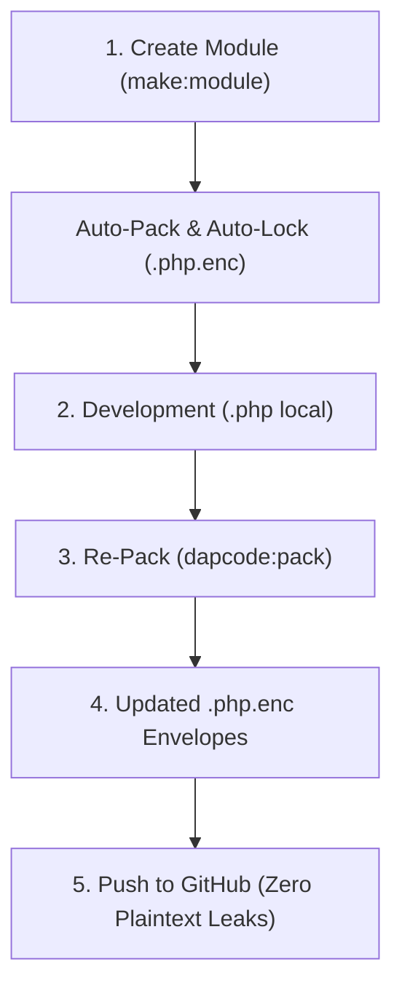

# DAPCODE AEGISGUARD™ — ARSITEKTUR KEAMANAN LISENSI & ENCRYPTED RUNTIME

## 1. Arsitektur 6-Layer Defense-in-Depth

DapCode AegisGuard™ mengimplementasikan sistem keamanan berlapis untuk mengontrol otorisasi, integritas, dan enkripsi modul aplikasi:

1. **Layer 1: DapcodeLicenseMiddleware** (HTTP Perimeter Guard)
   Pintu gerbang HTTP request yang menjalankan validasi awal terhadap seluruh rute modul yang dituju.
2. **Layer 2: HMVC Dispatcher & Hierarchical Runner** (Module Resolution & Dispatch Boundary)
   Memastikan class modul tidak dapat di-resolve atau diinstansiasi tanpa otorisasi lisensi yang valid. Dilengkapi dengan *Canonical Module Resolver* yang menolak traversal (`..`), encoding ganda, dan karakter berbahaya.
3. **Layer 3: Base Controller & Core Controllers** (Instantiation & Render Guard)
   Memvalidasi otorisasi di konstruktor controller modul (`__construct()`), `render()`, dan `moduleRender()` sebelum merender tampilan ke browser (`App\Http\Controllers\Core`).
4. **Layer 4: RSA-2048 Digital Licensing & Authority Secret Passcode** (Cryptographic Licensing Boundary)
   Memverifikasi keabsahan tanda tangan digital RSA-2048 dengan public verification key dan validasi constant-time SHA-256 hash passcode. Bebas dari hardcoded plaintext credentials di client repo.
5. **Layer 5: Core File Integrity Service** (Anti-Tamper Checksum Verification)
   Memverifikasi SHA-256 hash file inti arsitektur lisensi menggunakan manifest integritas (`integrity_manifest.json`). Modifikasi file core secara ilegal langsung memicu status `INTEGRITY_FAILED`.
6. **Layer 6: Encrypted Critical Module Protection & Atomic Runtime** (AES-256-GCM Envelope Encryption)
   Menyimpan source code controller & model dalam format terenkripsi (`.php.enc`) di repositori fresh clone GitHub. Source code didekripsi ke file `.php` lokal saat lisensi aktif, dan dihapus (*fail-closed lock*) saat lisensi dicabut (*Revoked*).

---

## 2. Alur Enkripsi & Dekripsi Atomic (Layer 6)

```text
[ Encrypted Module (.php.enc) ]
           ↓
    [ Read Envelope ]
           ↓
[ Validate Manifest (Anti-Traversal) ]
           ↓
 [ Validate RSA License Signature ]
           ↓
 [ Validate Installation ID & Status ]
           ↓
   [ HKDF-SHA256 Key Derivation ]
           ↓
   [ AES-256-GCM Decryption ]
           ↓
 [ Verify GCM Authentication Tag ]
           ↓
[ Verify SHA-256 Checksum vs Manifest ]
           ↓
 [ Write to Temporary File (.tmp) ]
           ↓
   [ Verify Temporary File ]
           ↓
 [ Atomic Rename to Runtime Target (.php) ]
           ↓
      [ Execute Module ]
```

---

## 3. Developer Workflow & Packaging Engine

Untuk memfasilitasi siklus pengembangan modul tanpa membocorkan source code plaintext ke Git:



### Command Lifecycle:
* **Membuat Modul:** `php artisan make:module {Nama}` (atau klik tombol **`+ Make Module`** di Web Terminal).
* **Mengemas Kode Terbaru:** `php artisan dapcode:pack {module=all}` (atau klik tombol **`dapcode:pack all`** di Web Terminal).
* **Melihat Status Keamanan:** `php artisan dapcode:module status`.

---

## 4. Batasan Keamanan & Trust Boundary (White-Box Limitation)

> **Pernyataan Batasan Keamanan:**
> Proteksi enkripsi modul dan layered execution guard memastikan bahwa repository fresh clone tidak menyimpan source code kritis dalam bentuk plaintext dan modul hanya dapat dibuka jika memiliki lisensi sah yang terikat pada Installation ID terkait.
> Namun demikian, pada server on-premise di mana pengguna memiliki hak *root access* dan kontrol penuh atas runtime interpreter PHP, pengguna dengan kemampuan teknis tingkat tinggi secara teoritis dapat melakukan memory dumps atau runtime patching.
> Enkripsi modul berfungsi sebagai **Defense-in-Depth Berlapis Tinggi**, bukan jaminan keamanan absolut terhadap attacker dengan kontrol runtime penuh.
